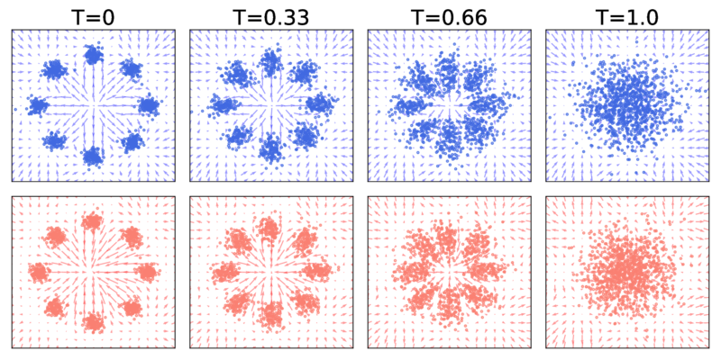
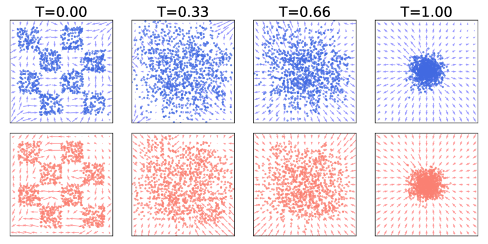
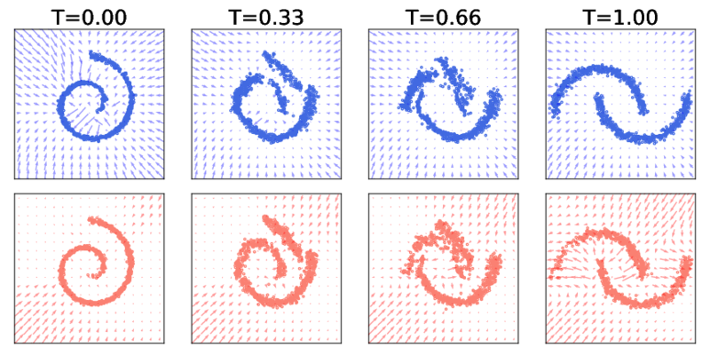

# SB-FBSDE: Likelihood Training of Schrödinger Bridge using Forward-Backward SDEs Theory [[ICLR 2022](https://openreview.net/pdf?id=nioAdKCEdXB)]

Official PyTorch implementation of the paper 
"_Likelihood Training of <ins>**S**</ins>chrödinger <ins>**B**</ins>ridge using <ins>**F**</ins>orward-<ins>**B**</ins>ackward <ins>**SDE**</ins>s Theory_ (**SB-FBSDE**)" which introduces
a new class of deep generative models that generalizes score-based models to fully nonlinear forward and backward diffusions.

This repo is co-maintained by [Guan-Horng Liu](https://ghliu.github.io/) and [Tianrong Chen](https://tianrongchen.github.io/). Contact us if you have any questions! If you find this library useful, please cite :arrow_down:
```
@inproceedings{chen2022likelihood,
  title={Likelihood Training of Schr{\"o}dinger Bridge using Forward-Backward SDEs Theory},
  author={Chen, Tianrong and Liu, Guan-Horng and Theodorou, Evangelos A},
  booktitle={International Conference on Learning Representations},
  year={2022}
}
```

## Examples

| p0 ⇆ pT (`--problem-name`)  | Results (blue/left: p0 ← pT, red/right: p0 → pT) |
|-------------------------|-------------------------|
| Mixture Gaussians ⇆ Gaussian (`gmm`) |  |
| CheckerBoard ⇆ Gaussian (`checkerboard`) |  | 
| Spiral ⇆ Moon (`moon-to-spiral`) |  | 
| CIFAR-10 ⇆ Gaussian (`cifar10`) | <p float="left">    </p> |

## Installation

This code is developed with Python3. PyTorch >=1.7 (we recommend 1.8.1). First, install the dependencies with [Anaconda](https://www.anaconda.com/products/individual) and activate the environment `sb-fbsde` with
```bash
conda env create --file requirements.yaml python=3
conda activate sb-fbsde
```

## Training

```bash
python main.py \
  --problem-name <PROBLEM_NAME> \
  --forward-net <FORWARD_NET> \
  --backward-net <BACKWARD_NET> \
  --num-FID-sample <NUM_FID_SAMPLE> \ # add this flag only for CIFAR-10
  --dir <DIR> \
  --log-tb 
```
To train an SB-FBSDE from scratch, run the above command, where
- `PROBLEM_NAME` is the dataset. We support `gmm` (2D mixture of Gaussian), `checkerboard` (2D toy dataset), `moon-to-spiral`, `mnist`, `celebA32`, `celebA64`, `cifar10`.
- `FORWARD_NET` & `BACKWARD_NET` are the deep networks for forward and backward drifts. We support `Unet`, `nscnpp`, and a `toy` network for 2D datasets.
- `NUM_FID_SAMPLE` is the number of generated images used to evaluate FID locally. We recommend 10000 for training CIFAR-10. Note that this requires first downloading the [FID statistics checkpoint](https://github.com/ghliu/SB-FBSDE#evaluating-the-cifar-10-checkpoint). 
- `DIR` specifies where the results (e.g. snapshots during training) shall be stored.
- `log-tb` enables logging with Tensorboard.

Additionally, use `--load <LOAD>` to restore previous checkpoint or pre-trained model.
For training CIFAR-10 specifically, we support loading the pre-trained [NCSN++](https://drive.google.com/drive/folders/1sP4GwvrYiI-sDPTp7sKYzsxJLGVamVMZ) as the backward policy of the first SB training stage (this is because the first SB training stage can degenerate to denoising score matching under proper initialization; see more details in [Appendix D of our paper](https://openreview.net/pdf?id=nioAdKCEdXB)).


Other configurations are detailed in [`options.py`](https://github.com/ghliu/SB-FBSDE/blob/main/options.py). The default configurations for each dataset are provided in the [`configs`](https://github.com/ghliu/SB-FBSDE/blob/main/configs) folder. 

## Evaluating the CIFAR-10 Checkpoint

To evaluate SB-FBSDE on CIFAR-10 (we achieve **FID 3.01** and **NLL 2.96**), create a folder `checkpoint` then download the model checkpoint and FID statistics checkpoint either from [Google Drive](https://drive.google.com/drive/folders/11yn3Aeq_KobGqntUqkz9mwuFLnpjGqq1?usp=sharing) or through the following commands.
```bash
mkdir checkpoint && cd checkpoint

# FID stat checkpoint. This's needed whenever we
# need to compute FID during training or sampling.
gdown --id 1Tm_5nbUYKJiAtz2Rr_ARUY3KIFYxXQQD 

# SB-FBSDE model checkpoint for reproducing results in the paper.
gdown --id 1Kcy2IeecFK79yZDmnky36k4PR2yGpjyg 
```

After downloading the checkpoints, run the following commands for computing either NLL or FID. Set the batch size `--samp-bs <BS>` properly depending on your hardware.
```bash
# compute NLL
python main.py --problem-name cifar10 --forward-net Unet --backward-net ncsnpp --dir ICLR-2022-reproduce
  --load checkpoint/ciifar10_sbfbsde_stage_8.npz --compute-NLL --samp-bs <BS>
```
```bash
# compute FID
python main.py --problem-name cifar10 --forward-net Unet --backward-net ncsnpp --dir ICLR-2022-reproduce
  --load checkpoint/ciifar10_sbfbsde_stage_8.npz --compute-FID --samp-bs <BS> --num-FID-sample 50000 --use-corrector --snr 0.15
```
